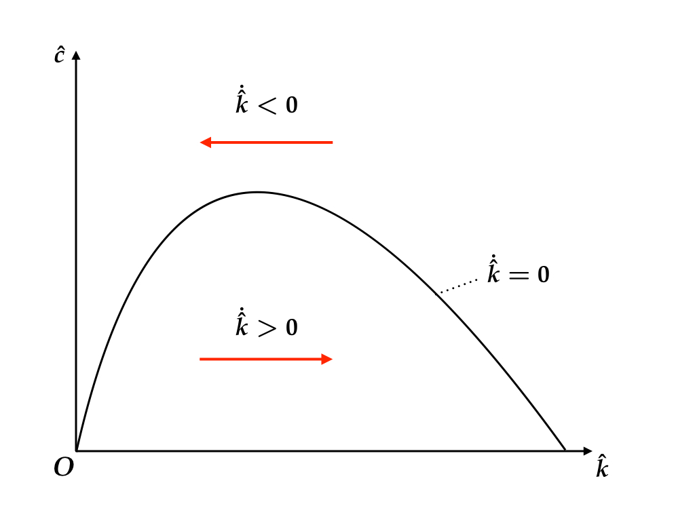
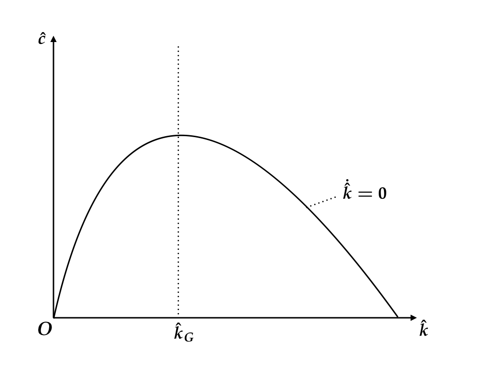
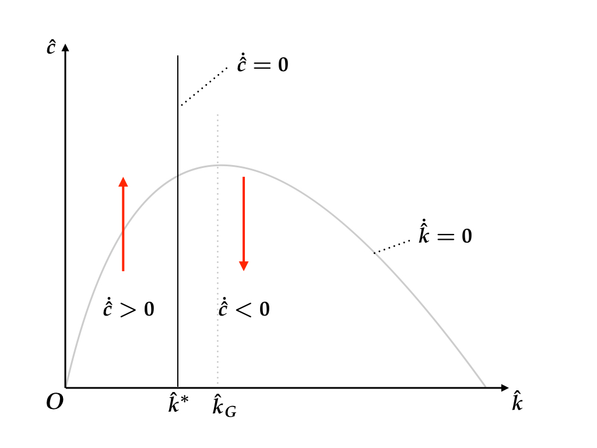
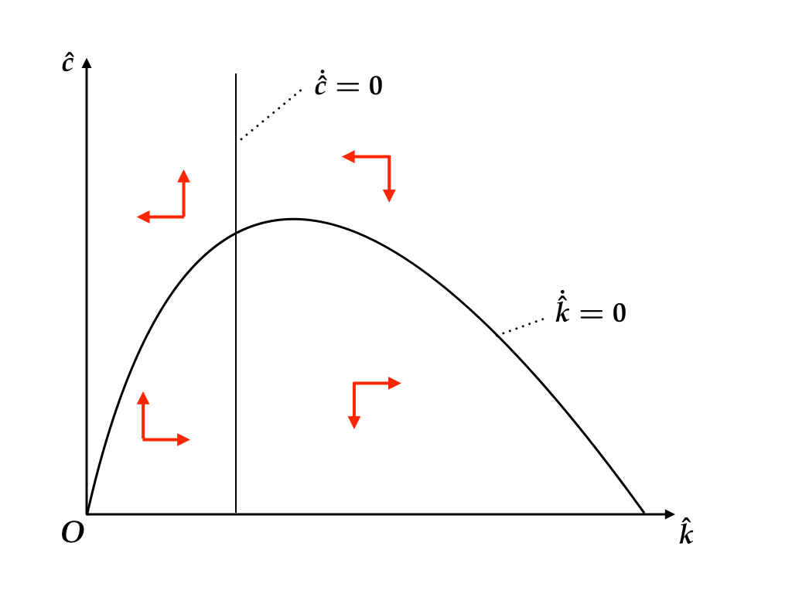
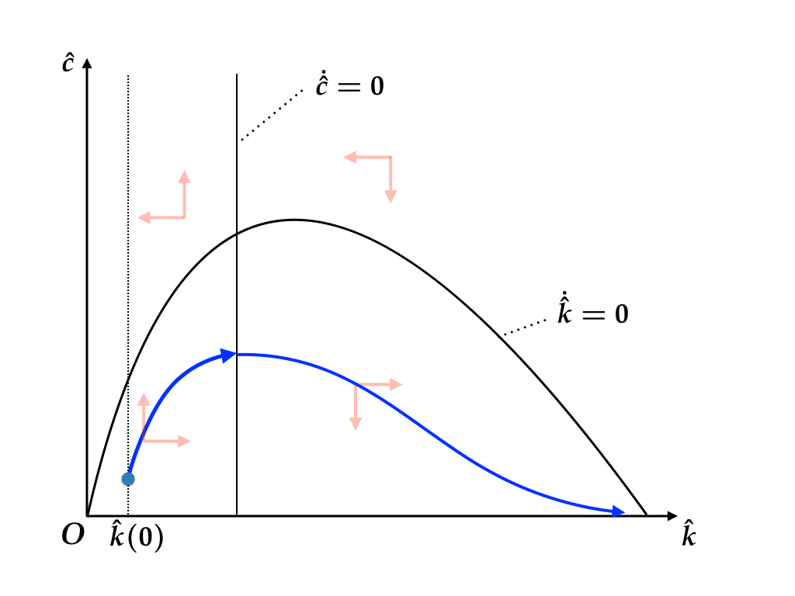
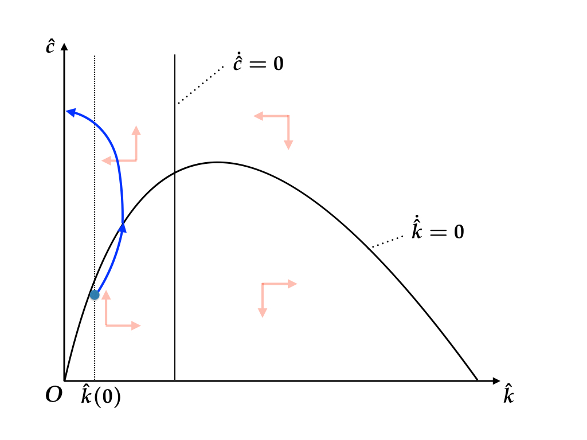
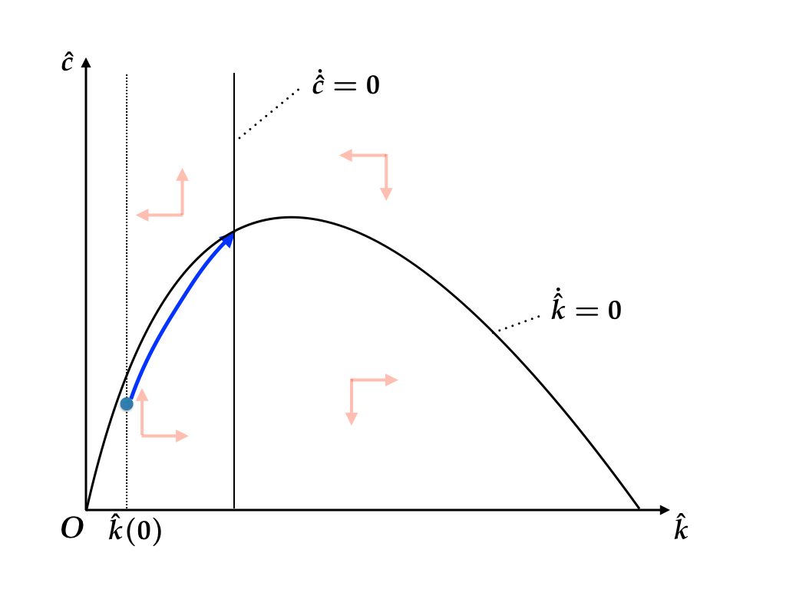
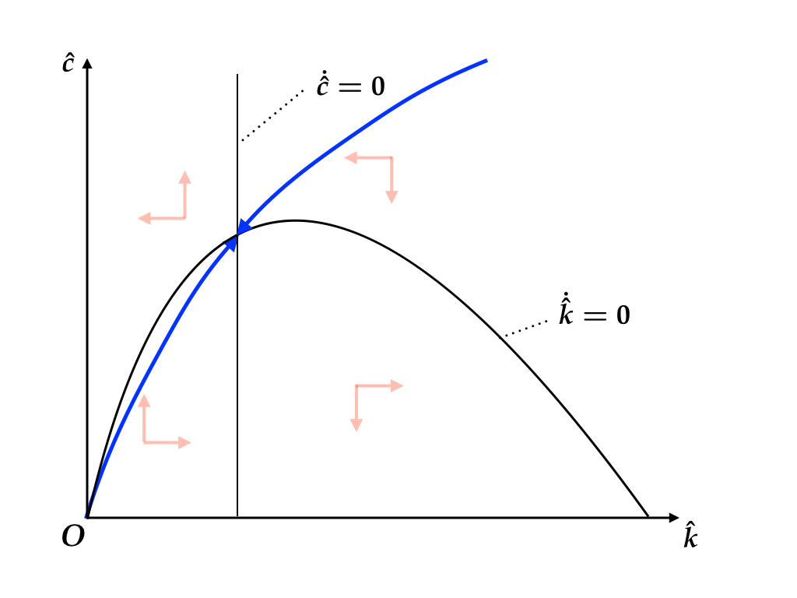

```{r setup, include=FALSE}
knitr::opts_chunk$set(fig.align = 'center')
source("../R/utils.R")
library(tidyverse)
```

<div style="margin-top: -2em"></div>

## Homework / Exercises

Visit [kjst.jp/ma17q2pr](http://kjst.jp/ma17q2pr) now to check your submission status. Make sure all your submissions got purple icons.

### Midterm Report

Get invitation for `mid`.

Visit [kjst.jp/ma17q2hw](kjst.jp/ma17q2hw)

> Due 2017-07-14 18:00.  
> Hand in by Pull Request.

---

## Additional assumption

Recall the objective function: 

$$\max \int_0^\infty e^{-(\rho - n) t} u(c(t)) dt,$$
where 
$$u(c) = \frac{c^{1 - \theta} - 1}{1 - \theta}.$$

Obviously, we have to assume $\rho - n > 0$. In the following analysis
we assume a slightly stronger condition:

$$\rho - n > \max \{ 0, (1-\theta)g\}$$


---

## Equilibrium: First-order Dynamics

The dynamics of the Ramsey model is determined by the following
two differential equations.


Capital accumulation equation:

$$\dot{\hat{k}} = f\left(\hat{k}\right) - \hat{c} - (\delta + g + n) \hat{k}$$

Euler equation:

$$\frac{\dot{\hat{c}}}{\hat{c}} =
\frac{f'\left(\hat{k}\right) - \delta - \rho - \theta g}{\theta}$$

---

## Locus of $\dot{\hat{k}} = 0$

Let's derive the condition under which $\dot{\hat{k}} = 0$.

From the capital accumulation equation,

$$\dot{\hat{k}} = f\left(\hat{k}\right) - \hat{c} - (\delta + g + n) \hat{k},$$
we obtain

$$\begin{aligned}
  \dot{\hat{k}} = 0 
  \Leftrightarrow
  \hat{c} = f\left(\hat{k}\right) - (\delta + g + n) \hat{k}
\end{aligned}$$

---

## Regions for $\dot{\hat{k}} > 0$ and $\dot{\hat{k}} < 0$

Moreover,

$$\begin{aligned}
  \dot{\hat{k}} > 0 
  \Leftrightarrow
  \hat{c} < f\left(\hat{k}\right) - (\delta + g + n) \hat{k}
\end{aligned}$$
and

$$\begin{aligned}
  \dot{\hat{k}} < 0 
  \Leftrightarrow
  \hat{c} > f\left(\hat{k}\right) - (\delta + g + n) \hat{k}
\end{aligned}$$

$\dot{\hat{k}}$ is increasing below the $\dot{\hat{k}} = 0$ locus
and decreasing above the locus.

---

## Regions for $\dot{\hat{k}} > 0$ and $\dot{\hat{k}} < 0$ (cont'd)

You can rewrite these conditions as below:

$$\begin{aligned}
  \dot{\hat{k}} \gtreqless 0 
  \Longleftrightarrow
  f\left(\hat{k}\right) - \hat{c} \gtreqless (\delta + g + n) \hat{k}
\end{aligned}$$

Capital increases if and only if the investment, 
$f(\hat{k}) - \hat{c}$, is greater than the break-even level,
$(\delta + g + n)\hat{k}$.

This condition is exactly what you have already encountered in the 
analysis of the Solow model.

---

## Phase diagram

```{r, out.width="800px", echo=FALSE}

```

---

## Golden Rule

Notice that the curve has a unique maximum, $\hat{k}_G$, where 

$$f'\left(\hat{k}_G \right) = \delta + g + n$$

must hold.

In the Solow model, the steady state that satisfies this 
condition is called the Golden Rule steady state, at which 
the consumption level is maximized over all steady states.

---

## Golden Rule (cont'd)

```{r, out.width="800px", echo=FALSE}

```

---

## Locus of $\dot{\hat{c}} = 0$

From 

$$\frac{\dot{\hat{c}}}{\hat{c}} =
\frac{f'\left(\hat{k}\right) - \delta - \rho - \theta g}{\theta}$$

we can derive the locus on which $\dot{\hat{c}} = 0$.

$$\dot{\hat{c}} = 0
\Longleftrightarrow
f'\left( \hat{k} \right) = \delta + \rho + \theta g$$

---

## Regions for $\dot{\hat{c}} > 0$ and $\dot{\hat{c}} < 0$

Obviously,

$$\dot{\hat{c}} \gtreqless 0
\Longleftrightarrow
f'\left( \hat{k} \right) \gtreqless \delta + \rho + \theta g$$

Since $f'$ is a decreasing function of $\hat{k}$,

$$\dot{\hat{c}} \gtreqless 0
\Longleftrightarrow
\hat{k} \lesseqgtr (f')^{-1}\left(\delta + \rho + \theta g\right)$$

Let's define 

$$\hat{k}^* =  (f')^{-1}\left(\delta + \rho + \theta g\right)$$

---

## Regions for $\dot{\hat{c}} > 0$ and $\dot{\hat{c}} < 0$ (cont'd)

Recall $f'(\hat{k}) - \delta = r$. The first-order condition for the 
consumption is easy to grasp when $g = 0$. 

$$\dot{\hat{c}} \gtreqless 0
\Longleftrightarrow
r \gtreqless \rho + \theta\cdot 0$$

Consumption is growing when benefit from waiting $\rho$
is greater than utility cost of waiting $\rho$.

When $g \neq 0$, an additional term is needed to adjust
for technology change. 

---

## Regions for $\dot{\hat{c}} > 0$ and $\dot{\hat{c}} < 0$ (cont'd)

```{r, out.width="800px", echo=FALSE}

```

---

## $\hat{k}^*$ and $\hat{k}_G$

Notice how I arranged the locus, $\hat{k} = \hat{k}^*$, and 
the Golden Rule level, $\hat{k} = \hat{k}_G$. 

By the assumption that $\rho - n > \max \{ 0, (1-\theta)g\}$,

$$f'\left(\hat{k}^* \right) = \delta + \rho + \theta g  > 
\delta + n + g = f'\left(\hat{k}_G\right)$$

which implies

$$\hat{k}^* < \hat{k}_G $$


---

## $\hat{k}^*$ and $\hat{k}_G$

The intersection, $\left(\hat{k}^*, \hat{c}^*\right)$, of the loci for $\dot{\hat{k}} = 0$ and 
$\dot{\hat{c}} = 0$ corresponds to the steady state 
level of $\left(\hat{k}, \hat{c}\right)$. 

In the steady state, the level of capital stock per 
unit of effective labor is necessarily smaller than the 
golden rule level. 

$\hat{k}^*$ is sometimes called, modified golden rule.

---

## Phase Diagram

```{r, out.width="800px", echo=FALSE}

```


---

## A trajectory from $\hat{k}(0) < k^*$: 1

```{r, out.width="800px", echo=FALSE}

```

---

## A trajectory from $\hat{k}(0) < k^*$: 2

```{r, out.width="800px", echo=FALSE}

```

---

## A trajectory from $\hat{k}(0) < k^*$: 3

```{r, out.width="800px", echo=FALSE}

```


---

## Optimal trajectory

The problem yet to be solved is the determination of 
$\hat{c}(0)$. Given $\hat{k}(0)$, depending on the level 
of candidates for $\hat{c}(0)$, the trajectories for the 
differential equations exibit either of the following.

1. $\hat{c}(t) \to 0$
2. $\hat{k}(t) \to 0$
3. $\hat{k}(t) \to \hat{k}^*$ and $\hat{c}(t) \to \hat{c}^*$

---

## Optimal trajectory (cont'd)

1. $\hat{c}(t) \to 0$
2. $\hat{k}(t) \to 0$

The first trajectory doesn't solve the maximization problem 
because by raising $\hat{c}(0)$ by a small amount we can 
make $\hat{c}(t)$ larger for any $t$. 

The second trajectory will eventually violate the feasibility 
condition.

---

## Optimal trajectory (cont'd)

3. $\hat{k}(t) \to \hat{k}^*$ and $\hat{c}(t) \to \hat{c}^*$

The third trajectory (which lies in the middlle of 1 and 2) 
converges to the steady state, 
$\left(\hat{k}^*, \hat{c}^*\right)$, where 
$\dot{\hat{k}} = 0$ and $\dot{\hat{c}} = 0$ hold simultaneously.

This trajectory is the optimal path. 

To obtain the convergence, the trajectory must start from 
an appropriate $\hat{c}(0)$. The steady state 
is said to be **saddle-point stable**.

---

## Optimal Consumption

For a given $\hat{k}(0)$, optimal $\hat{c}(0)$ is 
uniquely determined by the converging path to the steady state.
This mapping gives the optimal consumption function. (blue curve)

```{r, out.width="500px", echo=FALSE}

```


