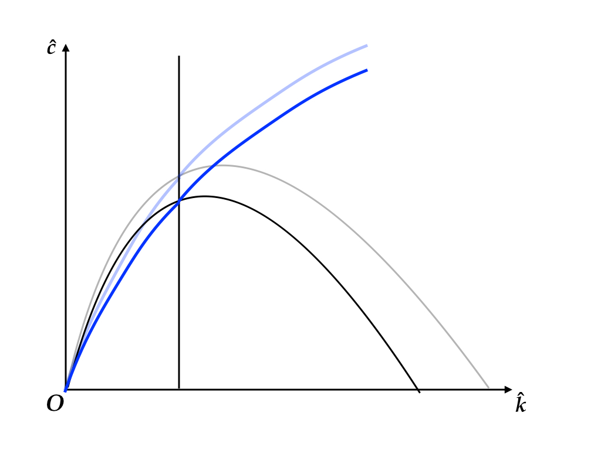
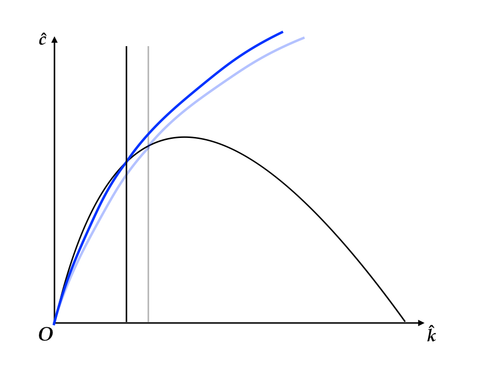
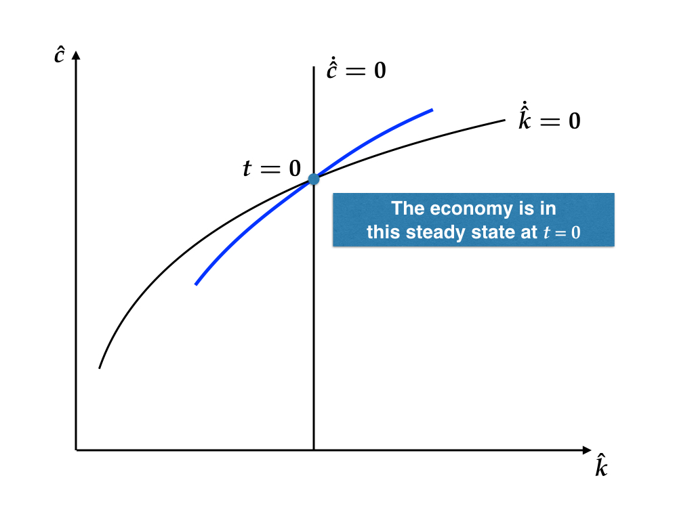
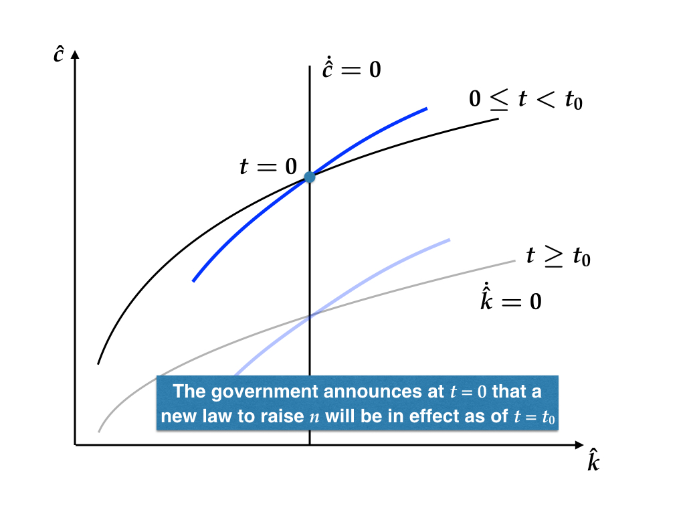
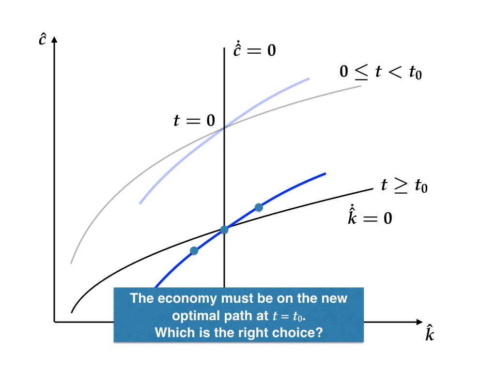
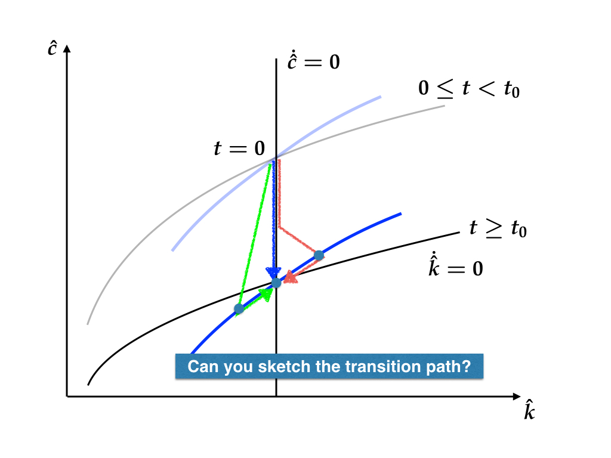

```{r setup, include=FALSE}
knitr::opts_chunk$set(fig.align = 'center')
source("../R/utils.R")
library(tidyverse)
```

<div style="margin-top: -2.3em"></div>

## Comparative statics/dynamics

The Ramsey model has the following parameters.

* $\delta$: depreciation
* $g$: technical growth rate
* $n$: population growth rate
* $\rho$: discount rate
* $\theta$: CRRA coefficient ($1/\theta$: elasticity of intertemporal substitution)

Comparative statics/dynamics exercises are concerned about 
a change in parameters.

---

## In the long run (comparative statics)

What will happen to the steady state and the steady state growth rates,
when one of the above parameters changes?

Sample questions

* Will the steady-state _growth rate_ of aggregate consumption, $C$, be increased or decreased 
  by an increase in $\delta$?
* What policy measure might be effective when (policy maker) you try to increase the level 
  of output per capita, $y = Y / L$, in the steady state?

Basically, this is what you have done in Problem Set K. 

---

## On transition (comparative dynamics)

As in the Solow model, the adjustment to the new steady state is not (necessarily) immediate.

You can analyze the transition to the new steady state by the phase diagram.

**For the moment we consider an immediate and permanent change in policy.**


---

## Example: Increase in $n$

$\dot{\hat{c}} = 0$ locus is unchanged because the Euler equation does not have $n$.

An increase in $n$ brings $\dot{\hat{k}} = 0$ locus down:

$$\hat{c} = f\left(\hat{k}\right) - (\delta + g + n) \hat{k}$$

The economy jumps down to the new steady state immediately.


---

## Example: Increase in $n$

```{r, out.width="800px", echo=FALSE}

```

---

## Example: Increase in $\rho$ 

$\dot{\hat{k}} = 0$ locus is unchanged because the capital accumulation equation does not have $\rho$.

An increase in $\rho$ shifts $\dot{\hat{c}} = 0$ locus to the left.


Recall that 

* $\hat{c}$ can be discontinuous
* $\hat{k}$ must be continuous

Describe the transition to the new steady state using the following diagram.


---

## Example: Increase in $\rho$

```{r, out.width="800px", echo=FALSE}

```

---

## Comparative statics/dynamics

You need to understand:

* How steady states move;
* How the economy adjusts to the new steady state.

As we discussed earlier in this course, anticipation for future 
is an important component of the Ramsey model.  

You can analyze implications of such a policy change as

* Permanent increase in $n$ due to an improvement of adoption policy
  or immigration policy, which will be enforced at a known point 
  in future.

---

## Example: Anticipated increase in $n$

```{r, out.width="800px", echo=FALSE}

```

---

## Example: Anticipated increase in $n$

```{r, out.width="800px", echo=FALSE}

```

---

## Example: Anticipated increase in $n$

```{r, out.width="800px", echo=FALSE}

```

---

## Example: Anticipated increase in $n$

```{r, out.width="800px", echo=FALSE}

```


